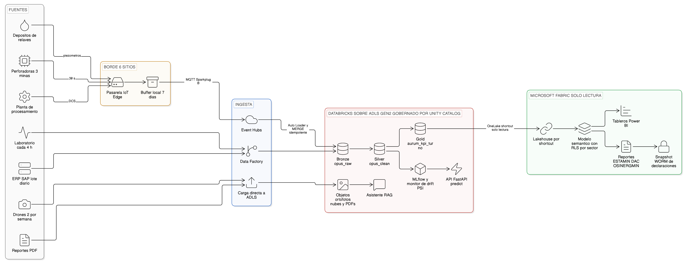
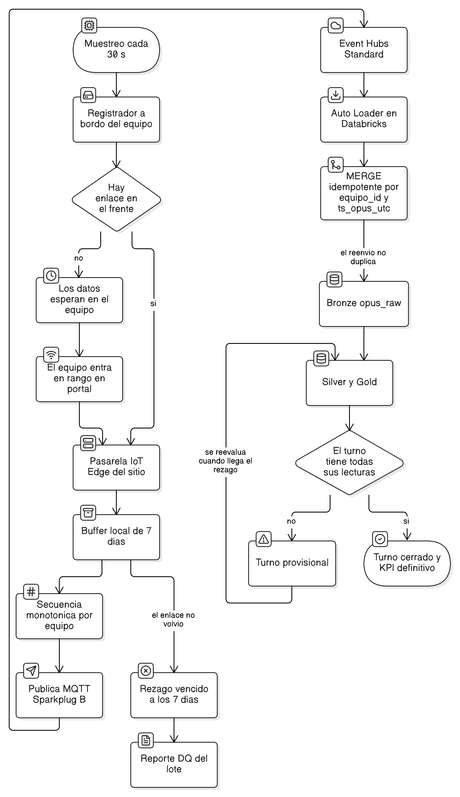

# Arquitectura de plataforma de datos UMLC

Decisiones de arquitectura del Ejercicio C-1 para la Unidad Minera La Cornisa: 3 minas
activas, 1 planta de procesamiento, 2 depósitos de relaves y un equipo de datos de 4
personas.

Todas las cifras de este documento salen de ejecutar [`costos.py`](costos.py), y
[`tests/test_costos.py`](tests/test_costos.py) las fija: si una tarifa cambia en el modelo y
no se actualiza aquí, la prueba falla. Las tarifas de Azure son de lista pública, región
East US, consultadas el 2026-08-30 contra la Azure Retail Prices API; una región
sudamericana las encarece y ese sobrecosto no está incorporado.

---

## 1. El escenario no es un problema de volumen

Antes de elegir plataforma hay que saber de qué tamaño es el problema. El dimensionamiento
parte del extracto real de la UMLC —10 equipos, 13 frentes, 4 sectores en una unidad— y lo
escala al escenario del enunciado.

| Fuente | Cadencia | Volumen anual |
|---|---|---|
| Sensores de perforación, 3 minas | cada 30 s | 390 señales |
| Sensores DCS de planta | cada 30 s | 250 señales |
| Piezómetros y geotecnia de 2 relaveras | cada 30 s | 120 señales |
| **Telemetría total** | | **798,912,000 lecturas, 30 a 89 GB comprimidos** |
| Análisis de laboratorio | cada 4 h | ~6,600 análisis |
| ERP SAP | lote diario | ~1.8 millones de filas (supuesto: 5 mil por día) |
| Imágenes de dron | 2 vuelos por semana | 1,560 a 6,240 GB |
| Reportes PDF | manual | más de 800 documentos |

```
== Volumetria del escenario ==
  Equipos de perforacion, 3 minas      390 senales
  Planta de procesamiento              250 senales
  Depositos de relaves                 120 senales
  TOTAL                                760 senales
  lecturas por anio: 798,912,000
  telemetria: 30 a 89 GB por anio comprimida
```

Dos consecuencias que ordenan todo lo que sigue.

**Ochocientos millones de filas al año pesan menos de 100 GB.** La cifra suena a gran
volumen y no lo es. A esta escala Databricks no se justifica por tamaño, y cualquier
discusión que empiece por «cómo guardamos los datos» está optimizando el rubro equivocado:
el almacenamiento es el 2 a 4% de la factura anual.

**Las imágenes de dron son más del 90% de los bytes y no entran a Delta.** Son ortofotos,
nubes de puntos y modelos de superficie: archivos que se referencian, no filas que se
consultan. Van a almacenamiento de objetos con un catálogo de metadatos, y meterlas al
lakehouse sería confundir peso con relevancia analítica.

El volumen de dron es el dato más débil de este modelo. No existe una cifra pública
autoritativa de GB por vuelo en minería; el rango 15 a 60 GB se deriva del sensor de
referencia (Zenmuse P1, 8192 x 5460 px, 44.7 MP) y de recuentos de imágenes publicados en
estudios de fotogrametría en minas a cielo abierto. La sección 7.3 muestra por qué esa
debilidad no cambia ninguna conclusión.

---

## 2. Plataforma: híbrido Databricks más Fabric

### 2.1 Las tres opciones

| Criterio | Databricks puro | Fabric puro | Híbrido (elegido) |
|---|---|---|---|
| **Operar con 4 personas** | Un plano de control, pero exige administrar clústeres, redes y permisos de lago; y el consumo termina en Power BI igual, que nadie administra. | El más barato de operar: SaaS, sin clústeres, sin red que dimensionar. Es su ventaja real y no es menor. | Dos planos. Se paga con una costura deliberadamente estrecha (2.2). |
| **Heterogeneidad de fuentes** | Auto Loader y Structured Streaming absorben IoT, laboratorio, SAP e imágenes sin coserlo a mano. | Cubre lote y SQL bien; el IoT con reenvío desordenado y deduplicación exige más artesanía. | Ingesta completa del lado Databricks. Fabric no ve una sola fuente cruda. |
| **Ciclo de vida de ML** (MLflow, PSI, reentrenamiento, rollback) | Su terreno: MLflow nativo, registro de modelos, monitoreo de inferencia bajo un catálogo. | Existe, pero el registro, la promoción entre etapas y el rollback automático piden pegamento propio. | Databricks. Es la razón técnica de no ir a Fabric puro. |
| **Consumo y regulatorio** (modelo semántico, RLS por sector, ESTAMIN / DAC / OSINERGMIN) | DBSQL más Power BI funciona, pero la RLS y la certificación de informes viven fuera del catálogo. | Su terreno: modelo semántico, RLS nativa, etiquetas de confidencialidad que sobreviven a la exportación. | Fabric. Es la razón de no ir a Databricks puro. |
| **Gobernanza y linaje** | Unity Catalog: clasificación, enmascaramiento por columna, linaje a nivel de columna, viaje en el tiempo. | OneLake Catalog cubre lo básico; linaje por columna y enmascaramiento más débiles. | Unity Catalog como autoridad; Fabric gobierna solo objetos de consumo (6.1). |
| **Costo y elasticidad** | Se paga por segundo y escala a cero, pero hay que sumar Power BI aparte. | Capacidad fija encendida: predecible, y penaliza el pico. | 17,962 a 42,719 USD al año, con Fabric al 51 a 65% de la factura. |
| **Cuándo sería la respuesta correcta** | Si el consumo fuera sobre todo técnico y no hubiera reportería regulatoria masiva. | **Si el equipo bajara de 4 personas o desapareciera el ciclo de ML.** | El caso actual. |

La última fila es deliberada. Declarar el umbral en que la decisión se revierte es lo que la
convierte en una decisión y no en una preferencia.

### 2.2 Dónde está exactamente la costura

Seis reglas concretas, no una metáfora.

1. **Una sola copia física.** Gold vive en ADLS Gen2 como tablas Delta escritas por
   Databricks y registradas en Unity Catalog. Fabric no replica: monta un *shortcut* de
   OneLake sobre ese contenedor y su Lakehouse lee exactamente los mismos ficheros Parquet.
   Cero ETL de sincronización y, por tanto, cero deriva entre plataformas.
2. **Dirección única.** Databricks escribe, Fabric lee. Nunca al revés.
3. **Solo cruza Gold.** Bronze y Silver no tienen atajo. Lo que no cruza no se puede exponer
   por error en un informe: es control de acceso por topología, no por política escrita.
4. **Gold es un contrato público.** Cambiar o quitar una columna de Gold se trata como un
   cambio de API: solo cambios aditivos, y los destructivos en secuencia expand/contract.
   Fabric nunca debe ver desaparecer una columna.
5. **En Fabric no se transforma.** Prohibidos Dataflow Gen2, notebooks de Fabric y vistas SQL
   con lógica de negocio. Si un KPI necesita cálculo, se calcula en Databricks y baja como
   columna. Lo único admitido es lógica de presentación: medidas DAX de agregación y formato,
   y la seguridad a nivel de fila.
6. **La regla 5 se hace cumplir con un permiso, no con un documento.** La identidad de
   servicio con la que Fabric monta el atajo tiene lectura sobre el contenedor Gold y ninguna
   escritura en ningún contenedor. Un pipeline en la sombra no está prohibido: no tiene dónde
   escribir.

El porqué de la regla 5: sin ella aparece un segundo pipeline que con 4 personas nadie
mantiene, y además rompe el linaje. Un número que nace en un Dataflow Gen2 no existe en Unity
Catalog, y entonces no se puede reproducir la declaración jurada de la que habla la sección
6.5.

### 2.3 Lo que cuesta el híbrido

| Costo | En qué se manifiesta | Cómo se acota |
|---|---|---|
| **Dos planos de permisos** | Unity Catalog concede sobre tablas; Fabric sobre workspace, modelo semántico y RLS. Dar de baja a alguien exige tocar dos sitios, y el que se olvida es el segundo. | Grupos de Entra ID como única fuente de identidad. Ni un usuario nominal en ninguno de los dos lados. |
| **Linaje partido** | Unity Catalog llega hasta Gold; de Gold al informe el linaje es de Fabric. No hay grafo único: «qué informes rompo si cambio esta columna» son dos consultas y un pegado manual. | Inventario versionado del contrato de Gold. Es el costo que no se elimina, solo se documenta. |
| **Dos ciclos de despliegue** | Databricks Asset Bundles de un lado, deployment pipelines de Fabric del otro. Un cambio que toca ambos no es atómico. | Cambios de Gold siempre aditivos, para que el desfase entre despliegues nunca rompa un informe. |
| **Bus factor** | Con 4 personas y dos plataformas, cada una tiene a lo sumo 2 personas que la entienden. | La costura estrecha reduce lo que hay que saber de Fabric a modelo semántico y RLS: días de aprendizaje, no meses. Es el argumento que sostiene toda la decisión. |

---

## 3. De las fuentes al consumo



El recorrido tiene cuatro tramos y un solo punto de cruce.

**Fuentes al borde.** Las tres familias de telemetría —perforación, planta y relaves— llegan
a una pasarela por sitio. Las otras cuatro fuentes no pasan por el borde: laboratorio y SAP
entran por Data Factory con la cadencia que les corresponde, y las imágenes de dron y los
PDFs se cargan directo a ADLS.

**Borde a la ingesta.** Es el tramo que decide la calidad de todo lo demás y tiene su propia
sección (4).

**Lago.** Medallion sobre ADLS Gen2, gobernado por Unity Catalog. Bronze conserva el crudo
con su metadata de ingesta; Silver limpia contra el diccionario y emite el reporte de calidad
por lote; Gold materializa `aurum_kpi_turno`. Los objetos —ortofotos, nubes de puntos y los
PDFs del asistente— viven fuera de Delta con su catálogo de metadatos. Sobre Silver se
entrenan los modelos del A-2, que MLflow registra y el monitor de PSI vigila.

**Consumo.** Dos salidas distintas. La operacional en tiempo de decisión es la API de
inferencia y el asistente documental, que se sirven desde Databricks porque leen del lago y
no del modelo semántico. La analítica y regulatoria pasa por el atajo de OneLake al Lakehouse
de Fabric, y de ahí al modelo semántico con RLS por sector, a los tableros y a los tres
reportes regulatorios de la sección 5.

---

## 4. Ingesta bajo conectividad intermitente



**Frecuencia de muestreo no es frecuencia de llegada.** El enunciado dice «sensores IoT cada
30 seg» y el error de lectura es tratarlo como un flujo continuo de 30 segundos. En minería
subterránea el equipo no tiene enlace en el frente: registra a bordo y descarga cuando sube a
portal o entra en rango. La telemetría llega a ráfagas, desordenada, con horas o días de
rezago, y a veces dos veces. Diseñar para un flujo continuo produce un pipeline que se rompe
el primer día de operación real.

**Store-and-forward con 7 días de buffer.** Cada sitio tiene una pasarela Azure IoT Edge que
retiene localmente una semana. Siete días cubre el peor caso realista de corte prolongado sin
convertir la pasarela en un almacén: pasado ese plazo el rezago se descarta y se registra en
el reporte de calidad del lote, que es la diferencia entre perder datos y perderlos en
silencio.

**Secuencia monotónica por equipo y `MERGE` idempotente.** La pasarela numera cada lectura
por equipo antes de publicar por MQTT Sparkplug B. En Bronze la escritura es un `MERGE` sobre
la llave `(equipo_id, ts_opus_utc)`. Un reenvío completo tras una caída no duplica nada, que
es la única forma de que el operador pueda reintentar sin pedir permiso.

**Turno provisional contra turno cerrado.** Este es el riesgo que un diagrama de ingesta
normal no muestra. Si el KPI de turno se publica en cuanto hay datos, un turno al que todavía
le falta telemetría por subir se lee como definitivo, y alguien toma una decisión de
planeamiento sobre una ley promedio incompleta. Gold marca explícitamente el estado del
turno; el KPI solo pasa a definitivo cuando cierra la ventana de rezago, y los tableros
muestran esa marca.

**Por qué Event Hubs y no IoT Hub.** IoT Hub cobra por unidad de nivel dimensionada en
mensajes diarios y aporta identidad y gestión por dispositivo, que es lo correcto cuando hay
miles de dispositivos independientes. Aquí hay 760 señales detrás de 6 pasarelas que ya
agregan. Las 2,188,800 lecturas diarias exigirían 6 unidades S1, a 25 USD por unidad y mes:
1,800 USD al año, o 3,000 con una S2. Event Hubs Standard cubre el mismo tráfico con una sola
unidad de rendimiento por 285 USD al año, o 1,161 con la captura a Delta activada. Se paga
por identidad de dispositivo solo si se necesita gestionar dispositivos; aquí se gestionan
seis pasarelas, y eso se hace con IoT Edge.

---

## 5. Obligaciones regulatorias

Tres obligaciones ante el Estado peruano, con cadencias distintas, y cada una define qué
tabla debe existir y con qué retención.

| Obligación | Cadencia | Plazo | Origen del dato |
|---|---|---|---|
| ESTAMIN, declaración estadística mensual | mensual | 10 días calendario tras el cierre de mes, por la extranet del MINEM | Gold: producción y ley por unidad |
| DAC, Declaración Anual Consolidada (art. 50 del TUO de la Ley General de Minería, DS 014-92-EM) | anual | cronograma por último dígito de RUC | Gold consolidado del año |
| Reportes geotécnicos de depósitos de relaves ante OSINERGMIN | inspección mensual por componente e interpretación semestral | primeros 10 días hábiles de abril y octubre, por el sistema de supervisión virtual | telemetría de piezómetros y desplazamiento |

El incumplimiento tiene multa: hasta 6 UIT en ESTAMIN para el régimen general y hasta 15 UIT
en la DAC para mediana y gran minería. Eso convierte la disponibilidad de la capa Gold en un
requisito con consecuencia económica, no en una aspiración de servicio.

La tercera fila explica por qué los depósitos de relaves aparecen en el diagrama con la misma
jerarquía que las minas. La telemetría geotécnica no es un extra ambiental: es el insumo de
una obligación con fecha, y una interrupción prolongada del enlace en la relavera es un
problema regulatorio antes que analítico.

---

## 6. Gobernanza

### 6.1 Unity Catalog es la autoridad; qué queda del lado de Fabric

Regla de asignación: **si un permiso se puede expresar en Unity Catalog, se expresa en Unity
Catalog.** Fabric solo recibe lo que no tiene equivalente allí.

Queda en Fabric, y solo esto:

- Los workspaces por dominio —Operaciones, Geología, Relaves, Regulatorio— y sus permisos.
- El modelo semántico: medidas, jerarquías, formato y la **seguridad a nivel de fila por
  sector**. Es un objeto de Fabric porque se aplica sobre el modelo, no sobre la tabla.
- La certificación de informes y modelos semánticos, que es el mecanismo por el cual un
  operador distingue el informe oficial del que alguien armó el jueves.
- **Las etiquetas de confidencialidad de Purview**, que es donde de verdad se fuga un dato:
  alguien exporta a Excel y lo manda por correo. Unity Catalog no protege nada fuera del
  lago; la etiqueta viaja pegada al archivo exportado.
- La bitácora de actividad: quién abrió qué informe y, sobre todo, quién exportó.

No queda en Fabric: definición y clasificación de columnas, enmascaramiento, linaje del dato,
política de retención y el snapshot inmutable de las declaraciones. Todo eso es Unity Catalog
más almacenamiento.

### 6.2 Clasificación de datos

Cuatro niveles, aplicados como etiquetas de Unity Catalog y heredados por las vistas.

| Nivel | Qué incluye | Control |
|---|---|---|
| Público | producción agregada ya declarada al MINEM | sin restricción interna |
| Interno | KPI de turno, disponibilidad de equipos, reportes de calidad | grupo de operaciones |
| Restringido | `op_id`, códigos de falla por operador, costos unitarios | acceso nominal y auditado |
| Privilegiado | coordenadas de yacimiento, resultados de exploración no publicados | dominio aislado, sin atajo a Fabric |

### 6.3 Exploración no publicada y coordenadas de yacimiento

Es el único dominio que no cruza a Fabric bajo ninguna circunstancia. Dos riesgos distintos
lo justifican, y conviene nombrarlos por separado porque tienen mitigaciones distintas.

El primero es de mercado: los resultados de exploración no publicados son información
privilegiada, y su filtración es un incidente de cumplimiento antes que de seguridad
informática. El segundo es físico: publicar la coordenada de un hallazgo atrae invasión de
minería informal, y eso pone en riesgo a personas y a la concesión.

Mitigación: catálogo separado con acceso nominal, enmascaramiento a nivel de columna sobre
las coordenadas para todo rol que no sea geología, prohibición técnica de atajo desde OneLake
—expresada como ausencia de permiso, no como norma— y auditoría de acceso con alerta sobre
lectura masiva.

### 6.4 `op_id` viene anonimizado y aun así reidentifica

El diccionario declara `op_id` como operador anonimizado. Anonimizado no es lo mismo que no
identificable: cruzando turno, equipo y fecha, cualquiera con acceso al rol de turnos
reconstruye quién operaba. Un tablero que muestre tasa de falla por `op_id` es, en la
práctica, un tablero de desempeño individual publicado sin que nadie lo haya decidido, con
implicaciones laborales y sindicales.

Por eso `op_id` no baja a la capa de consumo. Los análisis que lo requieran viven en el lago,
bajo acceso nominal, y lo que llega a Gold son agregaciones con un mínimo de operadores por
celda.

### 6.5 Reproducir una declaración jurada dos años después

La DAC es una declaración jurada bajo el artículo 50 de la Ley General de Minería. Si dentro
de dos años la fiscalización cuestiona una cifra declarada, hay que reproducirla exactamente,
con los datos que existían el día en que se declaró.

**El viaje en el tiempo de Delta no sirve para eso.** `VACUUM` con su retención por defecto
de siete días elimina los ficheros de versiones anteriores, y lo hace en silencio: la tabla
sigue respondiendo, solo que ya no alcanza la versión declarada. Una arquitectura que confíe
el respaldo regulatorio al historial de la tabla viva descubre el problema el día de la
fiscalización.

La mitigación es explícita: cada declaración congela un snapshot inmutable del Gold que la
alimentó, sobre almacenamiento con política de inmutabilidad, con retención alineada al plazo
de fiscalización y no a la política operativa de la tabla. Es un requisito de gobernanza que
se materializa en una opción de configuración, que es donde suelen morir los requisitos de
gobernanza.

---

## 7. Costos

### 7.1 Supuestos y tarifas

Tarifas de lista, región East US, consultadas el 2026-08-30 contra la Azure Retail Prices
API, salvo la licencia de Power BI, que es lista pública de Microsoft vigente desde abril de
2025.

| Concepto | Tarifa |
|---|---|
| Capacidad Fabric, pago por uso | 0.18 USD por CU-hora |
| Capacidad Fabric, reserva de 1 año | 938.00 USD por CU-año |
| Power BI Pro | 14 USD por usuario y mes |
| Databricks Premium Jobs Compute | 0.30 USD por DBU-hora |
| Databricks Premium All-purpose Compute | 0.55 USD por DBU-hora |
| VM Standard_D4ds_v5 Linux, bajo demanda / Spot | 0.226 / 0.047709 USD por hora |
| ADLS Gen2 Hot / Cool / Archive LRS | 0.0208 / 0.0152 / 0.00099 USD por GB-mes |
| Event Hubs Standard: unidad / eventos / captura | 0.03 USD-hora / 0.028 por millón / 0.10 USD-hora |
| `text-embedding-3-large` | 0.00013 USD por 1K tokens |
| `gpt-4o-mini`, entrada / salida | 0.00015 / 0.0006 USD por 1K tokens |

Supuestos que separan los dos extremos: el escenario bajo es F8 con 25 visores, 3 horas
diarias de jobs con workers Spot y 20 horas mensuales de exploración interactiva; el alto es
F16 con 40 visores, 8 horas diarias de jobs bajo demanda y 60 horas interactivas. Cinco años
de telemetría retenida en caliente y un año de dron en frío con cuatro en archivo.

### 7.2 Estimación anual

```
== Estimacion anual, USD ==
  Fabric y licencias Power BI        11,704 -     21,728   (65.2% - 50.9%)
  Databricks jobs                     1,142 -      4,608   ( 6.4% - 10.8%)
  Databricks interactivo                559 -      1,676   ( 3.1% -  3.9%)
  Almacenamiento                        396 -      1,546   ( 2.2% -  3.6%)
  Ingesta                             1,161 -      1,161   ( 6.5% -  2.7%)
  Servicios, RAG, red y borde         3,000 -     12,000   (16.7% - 28.1%)
  TOTAL                              17,962 -     42,719
```

### 7.3 Tres hallazgos

**No hay que saltar a F64.** Los visores gratuitos empiezan en F64 y el reflejo del mercado
es comprarla para dejar de pagar licencias Pro. El punto de indiferencia está en **313
visores**: con 40, F8 reservada más licencias cuesta 1,185 USD al mes contra 5,003 de F64.
Comprar F64 por licencias en una operación de este tamaño quema más de 45,000 USD al año.

```
  F8   pago por uso    1,051 | reservado      625 | descuento 40.5%
  F64  pago por uso    8,410 | reservado    5,003 | descuento 40.5%
  indiferencia entre F8 mas Pro y F64: 313 visores
     40 visores -> F8 mas Pro    1,185 contra F64    5,003
```

**En Databricks la máquina agrega 75% sobre el DBU.** El nodo de jobs cuesta 0.30 USD de DBU
más 0.226 de VM: presupuestar solo DBUs subestima la factura en 43%. Mover los workers a Spot
baja el nodo-hora un 34%.

**El dato más débil del modelo no cambia ninguna conclusión.** El volumen de dron podría
estar mal estimado; la sensibilidad muestra cuánto tendría que errar para importar:

```
  dron x1   ->     6,240 GB por anio | almacenamiento    1,546 USD |  3.6% del total
  dron x5   ->    31,200 GB por anio | almacenamiento    7,285 USD | 15.0% del total
  dron x10  ->    62,400 GB por anio | almacenamiento   14,458 USD | 26.0% del total
```

Tendría que estar equivocado por un factor de diez para que el almacenamiento discuta con
Fabric por el primer lugar de la factura. Publicar un número débil con su sensibilidad al
lado es preferible a publicarlo solo o a omitirlo.

Un cuarto dato, para cerrar el rubro de servicios: el asistente RAG sobre los 800 documentos
reales cuesta **1.04 USD indexar el corpus completo, una sola vez**, y entre 12 y 263 USD al
año en consultas según se use un modelo económico o uno de frontera. Los tokens no son el
costo de un RAG; lo son la infraestructura del índice y las horas de construir y mantener el
conjunto de evaluación.

### 7.4 Optimizaciones del primer trimestre

| Acción | Efecto |
|---|---|
| Medir 4 a 6 semanas en pago por uso antes de reservar la capacidad | La reserva ahorra 40.5% pero compromete un año; reservar sobre una capacidad mal dimensionada congela el error |
| No comprar F64 por licencias | Hasta 45,800 USD al año con 40 visores |
| Jobs Compute con autoterminación en vez de All-purpose | El DBU interactivo cuesta 83% más que el de jobs |
| Workers Spot en los jobs no críticos | 34% del nodo-hora |
| Ciclo de vida a Cool a los 30 días y a Archive a los 180 para las ortofotos | Archive cuesta 5% de Hot; sin la política, los TB de dron se acumulan en caliente |
| Agregar en la pasarela en vez de pagar por dispositivo | 640 a 1,840 USD al año frente a IoT Hub |

---

## 8. Tres riesgos críticos

| Riesgo | Cómo se manifiesta | Mitigación | Cómo se detecta |
|---|---|---|---|
| **Conectividad intermitente en zona remota** | El KPI de un turno con telemetría pendiente se lee como definitivo y alguien planea sobre una ley promedio incompleta | Buffer de 7 días en la pasarela, secuencia monotónica por equipo, `MERGE` idempotente y estado explícito de turno provisional contra cerrado | Alerta sobre la proporción de turnos que siguen provisionales pasada la ventana de rezago, y sobre pasarelas sin contacto por más de N horas |
| **Cuatro personas operando dos plataformas** | Una de las dos queda con un solo responsable real; un cambio de Gold rompe un informe que nadie sabía que dependía de esa columna | Costura estrecha y unidireccional, contrato de Gold solo aditivo, identidad unificada en grupos de Entra ID, infraestructura como código en ambos lados | Revisión del inventario del contrato de Gold en cada cambio, y prueba automática que falla si un informe certificado pierde una columna |
| **Fuga de exploración no publicada o de coordenadas de yacimiento** | Información privilegiada expuesta en un informe o exportada a un archivo que sale por correo; en el caso de las coordenadas, riesgo físico por invasión informal | Dominio aislado sin atajo a Fabric, enmascaramiento por columna, acceso nominal, etiquetas de Purview que viajan con el archivo exportado | Auditoría de accesos con alerta sobre lectura masiva del dominio de geología y sobre exportaciones desde workspaces con datos restringidos |

---

## 9. Pendientes

Dos cosas quedan fuera de este documento y se resuelven junto con el Ejercicio C-2, para no
estimarlas dos veces:

- **Continuidad y recuperación ante desastre.** No hay objetivo de punto ni de tiempo de
  recuperación definido, ni replicación entre regiones dimensionada. Es una omisión real, no
  una decisión de alcance.
- **Ambiente de staging de la capacidad Fabric.** El modelo asume un solo ambiente
  productivo. Validar cambios del modelo semántico antes de promoverlos exige una segunda
  capacidad, con costo propio que no está en la estimación.

---

## Fuentes

Regulatorias: [ESTAMIN, MINEM](https://mineria.minem.gob.pe/obligaciones_mineras/estamin/) ·
[Declaración Anual Consolidada, MINEM](https://www.gob.pe/institucion/minem/colecciones/18136-declaracion-anual-consolidada-dac) ·
[RD 0144-2026-MINEM/DGM, cronograma DAC 2025](https://rubenfelix.ing/2026/03/28/cronograma-dac-2025-resolucion-0144-2026-minem/) ·
[Procedimiento sobre reportes de depósitos de relaves y monitoreo geotécnico, OSINERGMIN](https://busquedas.elperuano.pe/dispositivo/NL/2301235-1)

Tarifas: [Azure Retail Prices API](https://prices.azure.com/api/retail/prices) (Microsoft
Fabric, Azure Databricks, Storage, Event Hubs, IoT Hub, Foundry Models), región East US,
2026-08-30 · [Precios de Azure Databricks](https://azure.microsoft.com/en-us/pricing/details/databricks/) ·
[Precios de Data Lake Storage](https://azure.microsoft.com/en-us/pricing/details/storage/data-lake/)

Volumen de dron: [Zenmuse P1, especificaciones oficiales de DJI](https://enterprise.dji.com/zenmuse-p1/specs) ·
[Springer, DSM en mina de carbón a cielo abierto](https://link.springer.com/chapter/10.1007/978-3-319-68240-2_2) ·
[MDPI Minerals 14(12):1282](https://www.mdpi.com/2075-163X/14/12/1282) ·
[Swyvl, gestión de datos espaciales en minería](https://swyvl.io/blog/spatial-data-management-mining/)
